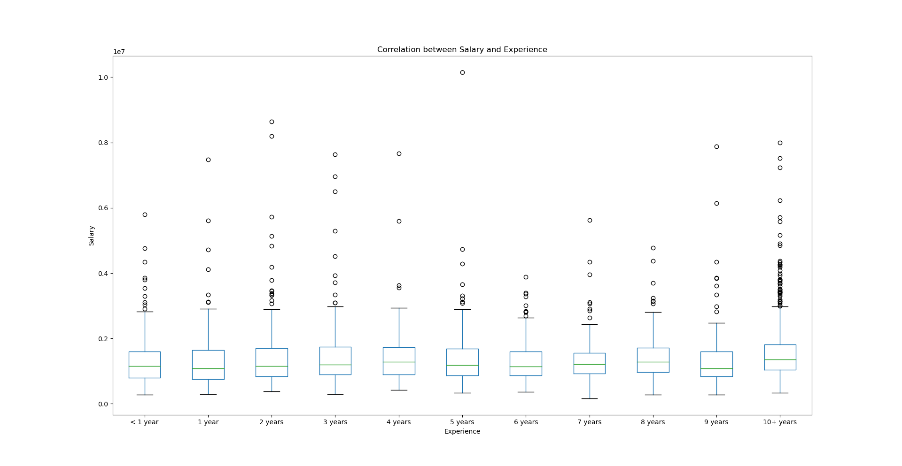
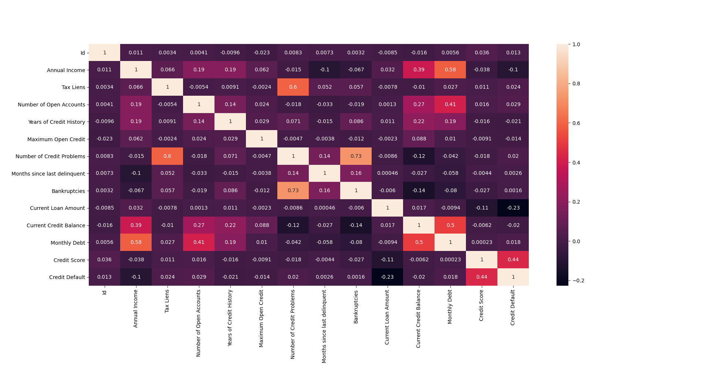
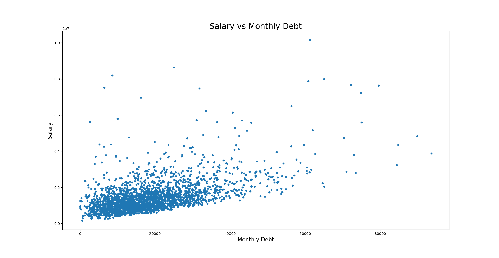
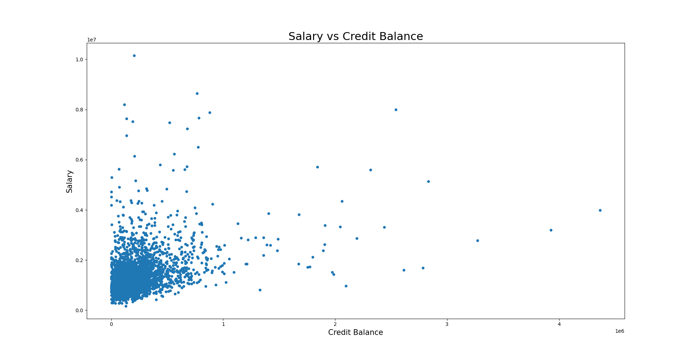
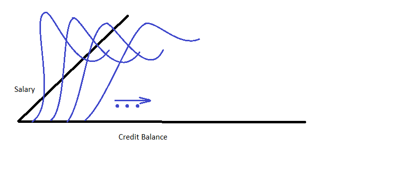
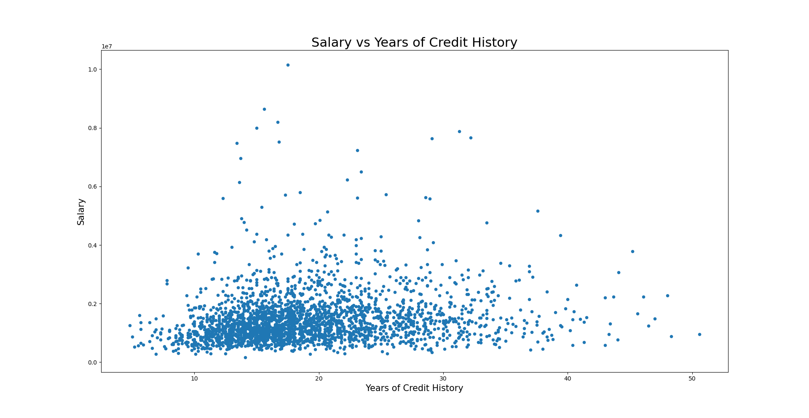
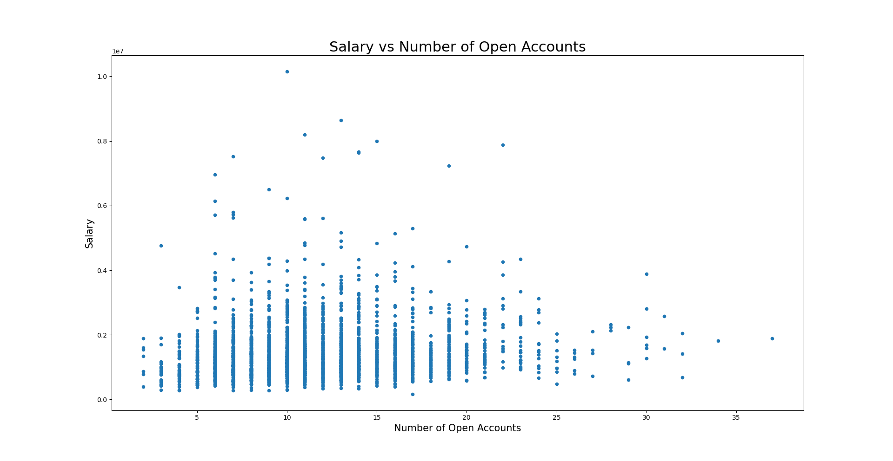
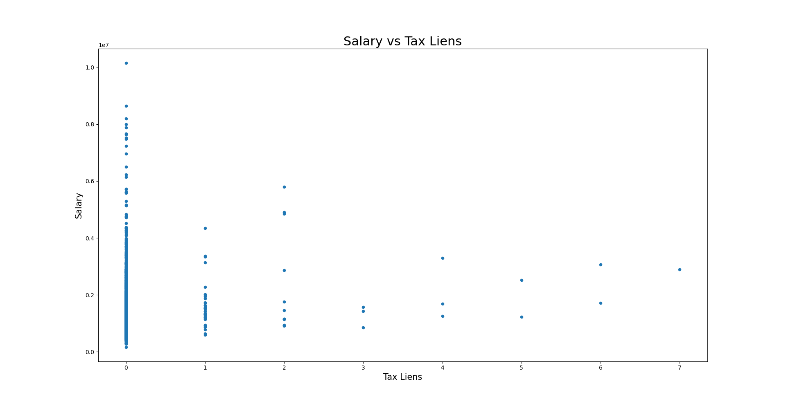
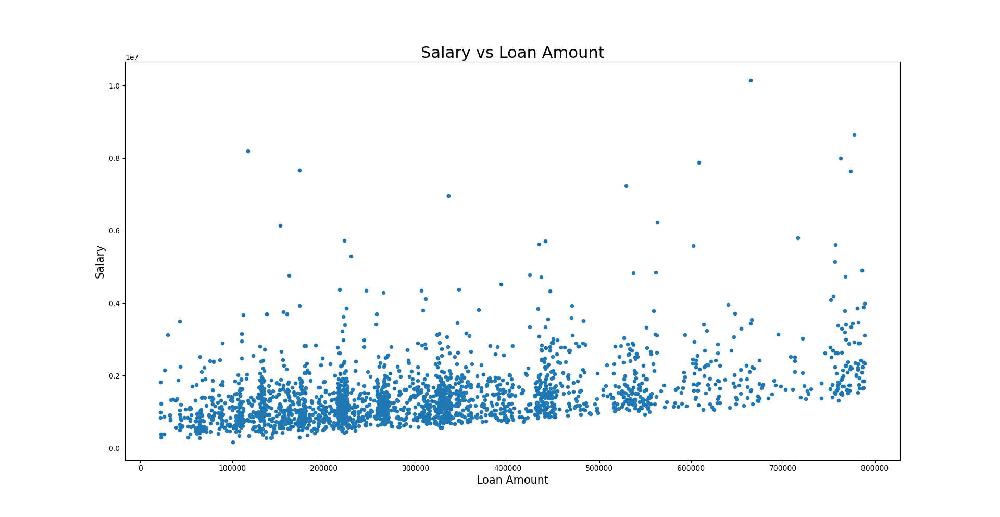

# Predicting Default on Loans
This is an attempt to predict who will default on loans based on existing customer data. 
This is a kaggle challenge. 
You can find it [here](https://www.kaggle.com/c/credit-default-prediction-ai-big-data/)

## Filling in missing values
The first step is do do something about missing values. 
There is missing data in the columns for salary, experience, delinquency, and credit scores.

### Salary vs Experience
My first intuition was that there may be a correlation between Salary and Experience. 
If this were true, we could at-least infer values for Salary or Experience where 1 is missing. 
To test this theory, I removed all records where either was missing and 
plotted Salary vs Experience in a box plot.

The following was the result:

As can be seen here, it doesn't look like there is any clear enough link between Salary and Experience
for us to perform an inference so I investigated other possible correlations.

### Correlation Matrix
I generated a correlation matrix. This is what I got:

### Salary vs Montly Debt

The following is the scatter plot for Salary vs Monthly Debt

This plot reveals a remarkable correlation. It looks like a simple linear
regression model should be good enough to infer Salary from Monthly Debt.
Also we can see that this plot is flat at the bottom which seems to 
indicate that for any given monthly debt, there must be a minimum salary.

### Salary vs Credit Balance
The following is the scatter plot of Salary vs Credit Balance

The correlation is less clear cut. The monthly debt seems to be a better
indicator of Salary but there could still be a cool way to infer Salary from
Credit Balance. As we can see, most of the dots are concentrated at the origin.
Intuitively, this means that if the credit balance is lower then it means that 
the salary is more likely lower than higher. Mathematically we can model
this is as a log-normal distribution. So for every point on the 
Credit Balance axis, we can take the Salary points and fit a Gaussian curve to their
density. Then given a Credit Balance value, we could generate a random
number for the Salary where the probability of getting each value is given
by the Gaussian we have fitted.

The model would end up looking something like this:

Some more scatter plots to reveal the correlation between Salary and other fields:

| | | 
|:-------------------------:|:-------------------------:|
|
|
 |

The Salary vs Loan Amount looks interesting. It is flat at the bottom. 
This indicates that in order to qualify for a loan of a specific amount you need to have 
a minimum salary.