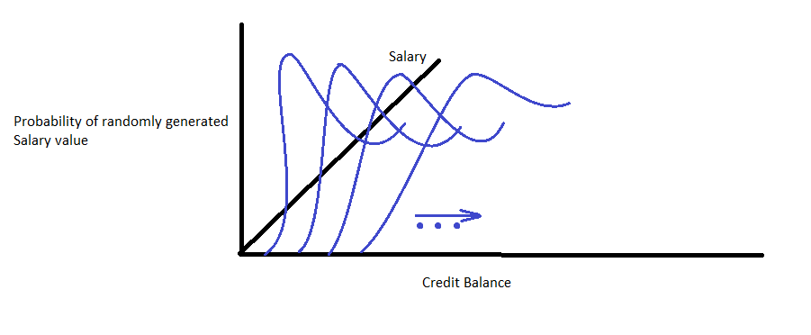

# Predicting Default on Loans
This is an attempt to predict who will default on loans based on existing customer data. 
This is a kaggle challenge. 
You can find it [here](https://www.kaggle.com/c/credit-default-prediction-ai-big-data/)

## Filling in missing values
The first step is do do something about missing values. 
There is missing data in the columns for salary, experience, delinquency, and credit scores.

### Salary vs Experience
My first intuition was that there may be a correlation between Salary and Experience. 
If this were true, we could at-least infer values for Salary or Experience where 1 is missing. 
To test this theory, I removed all records where either was missing and 
plotted Salary vs Experience in a box plot.

The following was the result:

As can be seen here, it doesn't look like there is any clear enough link between Salary and Experience
for us to perform an inference so I investigated other possible correlations.

### Correlation Matrix
I generated a correlation matrix. This is what I got:

### Salary vs Credit Balance
The following is the scatter plot of Salary vs Credit Balance

This chart looks much better. Even though the correlation isn't clear cut,
its more than non-existent. As we can see, most of the dots are concentrated
at the origin. Intuitively, this means that if the credit balance is lower
then it means that the salary is more likely lower than higher. Mathematically
we can model this is as a log-normal distribution. So for every point on the Credit Balance
axis, we can take the Salary points and calculate their mean and standard deviation, and 'a' co-efficient.
The model would end up looking something like this:

### Salary vs Loan

The following is the scatter plot of the Salary vs Loan Amount

This chart also looks interesting. The first remarkable trait is that it forms
a straight line at the bottom. This indicates that in order to qualify
for a loan of a specific amount you need to have a minimum salary. This is
another useful indicator and it enhances our ability to infer the missing
values of Salary.

### Salary vs Montly Debt

The following is the scatter plot for Salary vs Monthly Debt

This plot basically looks like a better version of the Salary vs Credit Balance plot
(ie. It'll be easier to model a lognormal distribution based on this correlation).
Alternatively, it maybe better to just fit a simple linear equation to this.
Also we can see that this plot is flat at the bottom which again seems to 
indicate that for any given monthly debt, there must be a minimum salary.

<!--

### Clean Salary column
+ The 'Annual Income' column was renamed to 'Salary'.
+ A new column called 'IsSalaryProvided' was added
+ All NaN values in the Salary column were replaced with the mean of the provided Salary values

### Clean Experience column
+ The 'Years in current job' column was renamed to 'Experience'
+ A new column called 'IsExperienceProvided' was added
+ The Experience column values were quantified and the mean was gotten: 5.88
+ All NaN values in Experience were replaced by the mean

### Delinquency
There are so many missing values for delinquency that I chose to completely remove it from the pipeline
for now.

### Credit Score
The next step is to do something about the missing values in Credit Score.
For this I decided to check if there is any correlation between one of the
existing columns and correlation

 -->